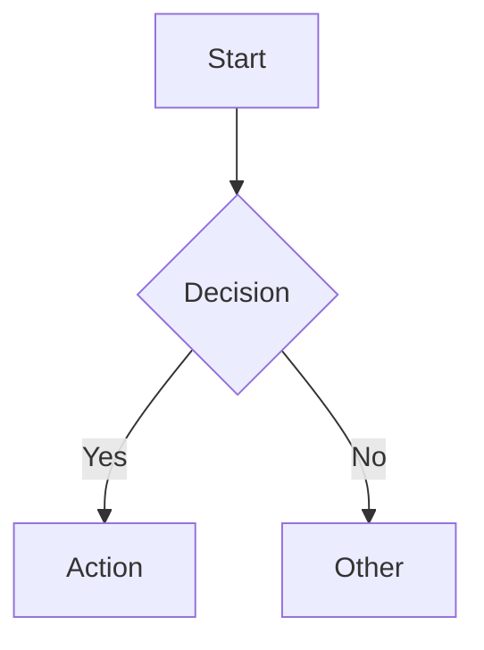
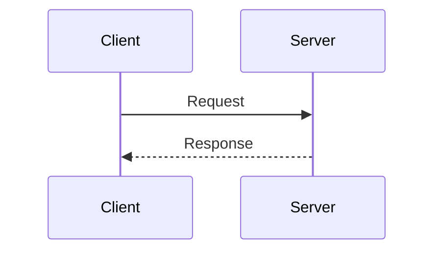
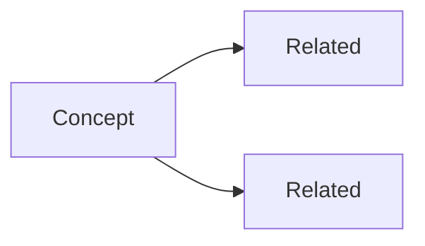

# Clarify

Restructure complex input into the most human-readable format for its information type.

## Output Structure

Always output in this order:

1. **Analogy** — one sentence comparing the subject to something from everyday life
2. **Visual** — diagram, tree, or table (see format selection below)
3. **Key points** — 3–5 bullets on what matters most
4. **Gotcha** — one common misconception or non-obvious detail worth flagging

Keep each section tight. No preamble. For simple inputs, skip Key points if the visual is self-explanatory.

## Step 1: Select Format

| Information Type | Signals | Format |
|-----------------|---------|--------|
| Hierarchy / containment | nested structure, "consists of", file trees | ASCII tree |
| Process / flow | steps, decisions, branching, "then" | Mermaid flowchart |
| Sequence / interaction | actors, requests, responses, timeline | Mermaid sequenceDiagram |
| Comparison / options | pros/cons, feature matrix, "vs" | Table |
| Concept network | relationships, dependencies, "connects to" | Mermaid graph |
| Mixed / large system | multi-aspect topic, architecture overview | Sections + mixed formats |

When in doubt, prefer simpler: ASCII tree over Mermaid if hierarchy is shallow; table over graph if relationships are few.

## Step 2: Format Reference

**ASCII tree** — hierarchies:
```
Root
├── Child A
│   ├── Grandchild 1
│   └── Grandchild 2
└── Child B
```

**Mermaid flowchart** — processes with decisions:


**Mermaid sequenceDiagram** — actor interactions:


**Table** — comparisons:
| Option | Pro | Con |
|--------|-----|-----|

**Mermaid graph** — concept networks:

