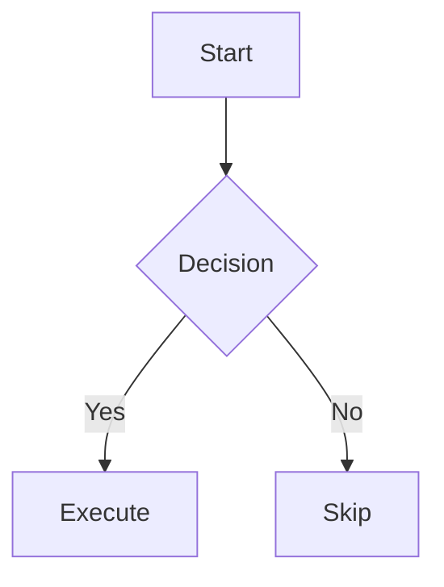

# Markdown Syntax

## Headings

```markdown
# H1
## H2
### H3
#### H4
```

## Text Formatting

- **Bold**: `**text**`
- *Italic*: `*text*`
- `Inline code`: `` `code` ``
- ~~Strikethrough~~: `~~text~~`

## Lists

```markdown
- Unordered item
  - Nested (2-space indent)

1. Ordered item
   1. Nested ordered
```

## Links and Images

```markdown
[link text](https://example.com)
[link text](https://example.com "title")

```

## Blockquotes

```markdown
> Quoted text
> > Nested quote
```

## Code Blocks

````markdown
```language
code block
```
````

## Tables

```markdown
| Col1   |  Col2  |   Col3 |
|--------|:------:|-------:|
| left   | center |  right |
```

## Task Lists

```markdown
- [ ] Incomplete
- [x] Complete
```

## Footnotes

```markdown
Body text[^1].

[^1]: Footnote content.
```

## Horizontal Rule

```markdown
---
```

## Alerts

```markdown
> [!NOTE]
> Useful information.

> [!TIP]
> Helpful advice.

> [!IMPORTANT]
> Key information.

> [!WARNING]
> Urgent info.

> [!CAUTION]
> Risks or negative outcomes.
```

## Collapsible Sections

```markdown
<details>
<summary>Click to expand</summary>

Content here (blank line after summary required).

</details>
```

## Math (LaTeX / MathJax)

Inline: `$E=mc^2$`

Block:
```markdown
$$
\int_0^\infty e^{-x^2} dx = \frac{\sqrt{\pi}}{2}
$$
```

## Mermaid Diagrams

````markdown

````

Supported types: `graph` `flowchart` `sequenceDiagram` `classDiagram` `gantt` `pie` `gitGraph`

## diff Highlighting

````markdown
```diff
- removed line
+ added line
```
````

## Auto-links (GitHub)

| Input | Result |
|-------|--------|
| `#123` | Issue/PR in same repo |
| `owner/repo#123` | Cross-repo issue/PR |
| `a5c3785` (7-char SHA) | Commit link |
| `@username` | User profile |

## Comments

```markdown
<!-- not rendered -->
```

## Escaping

Use `\` to escape special characters: `\*` `\[` `\\`
