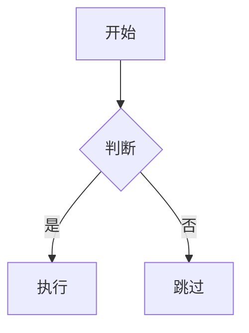

# Markdown 语法参考

三层组织：CommonMark 基础（所有渲染器通用）→ GFM 扩展（GFM 规范内，
GitHub / GitLab 等广泛支持）→ GitHub 专属（仅 GitHub.com 渲染器生效）。

来源：notes 仓 `Markdown-语法速查.md` 与 `Markdown-GitHub扩展语法.md`；
规范见 [CommonMark Spec](https://spec.commonmark.org/) 与
[GitHub Flavored Markdown](https://github.github.com/gfm/)。

## CommonMark 基础

### 标题

```markdown
# H1
## H2
### H3
#### H4
```

### 文本格式

- 粗体：`**text**`（`__text__` 亦合法，本仓约定用星号）
- 斜体：`*text*`（`_text_` 亦合法，本仓约定用星号）
- 行内代码：`` `code` ``
- 行内代码含反引号时用双反引号包裹：``` `` `code` `` ```

### 列表

```markdown
- 无序项
  - 嵌套项（2 空格缩进）

1. 有序项
2. 有序项
   1. 嵌套有序（对齐父项文字起始列）
```

### 链接与图片

```markdown
[链接文字](https://example.com)
[链接文字](https://example.com "标题")


```

### 引用

```markdown
> 引用文字
> > 嵌套引用
```

### 代码块

围栏代码块，语言标签跟在开栏反引号后：

````markdown
```language
代码块
```
````

代码块内容本身含三反引号时，外层用四反引号围栏。

### 分隔线

`---`、`***`、`___` 三种写法等价（本仓约定用 `---`）。

### 转义

用 `\` 让特殊字符按字面输出：`\*`、`\[`、`\#`、`` \` ``。

HTML 注释不渲染：

```markdown
<!-- 注释，不渲染 -->
```

## GFM 扩展

### 表格

```markdown
| 列1 | 列2 | 列3 |
|-----|:---:|----:|
| 左对齐 | 居中 | 右对齐 |
```

分隔行冒号控制对齐：`:---` 左、`:---:` 中、`---:` 右。

此处收录的是语法事实；本仓写作约定优先用列表而非表格
（见 markdown rule），仅在固定属性对比且单元格无成句内容时用表格。

### 删除线

`~~text~~`

### 任务列表

```markdown
- [ ] 未完成
- [x] 已完成
```

GitHub 额外行为：PR / Issue 正文中的任务列表可直接勾选，自动更新源文件。

### URL autolink

裸 URL 自动转为超链接：`https://example.com`（无需方括号语法）。

### 脚注

GitHub 支持，未入 GFM 正式规范：

```markdown
正文[^1]，具名[^note]

[^1]: 脚注内容
[^note]: 具名脚注
```

## GitHub 专属

仅 GitHub.com 渲染器生效，其他渲染器按普通引用块 / 原文处理。

### Alerts

```markdown
> [!NOTE]
> Useful information that users should know.

> [!TIP]
> Helpful advice for doing things better.

> [!IMPORTANT]
> Key information users need to know.

> [!WARNING]
> Urgent info that needs immediate attention.

> [!CAUTION]
> Advises about risks or negative outcomes.
```

### 折叠内容

```markdown
<details>
<summary>点击展开</summary>

内容（与 summary 之间必须空行，否则内部 Markdown 不渲染）

</details>
```

### 数学公式

MathJax / LaTeX 语法。行内：`$E=mc^2$`；块级：

```markdown
$$
\int_0^\infty e^{-x^2} dx = \frac{\sqrt{\pi}}{2}
$$
```

### Mermaid 图表

````markdown

````

支持类型：`graph` / `flowchart`、`sequenceDiagram`、`classDiagram`、
`gantt`、`pie` 等。

### 引用 autolink

GitHub 自动将以下写法转为链接：

- Issue / PR：`#123`（同仓库）、`owner/repo#123`（跨仓库）
- Commit：40 位完整 SHA 或 7 位短 SHA（如 `a5c3785`）
- 用户：`@username`；团队：`@org/team`

### 代码块语言高亮

GitHub 支持
[数百种语言](https://github.com/github-linguist/linguist/blob/master/lib/linguist/languages.yml)。
`diff` 高亮常用于前后对比：

````markdown
```diff
- 删除的行
+ 新增的行
```
````

### GeoJSON / TopoJSON 地图

````markdown
```geojson
{
  "type": "FeatureCollection",
  "features": [...]
}
```
````

### STL 3D 模型

````markdown
```stl
solid ...
```
````
