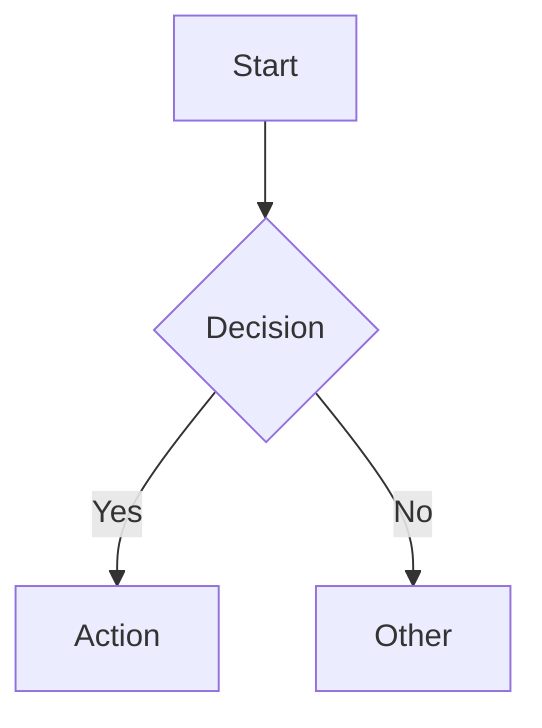
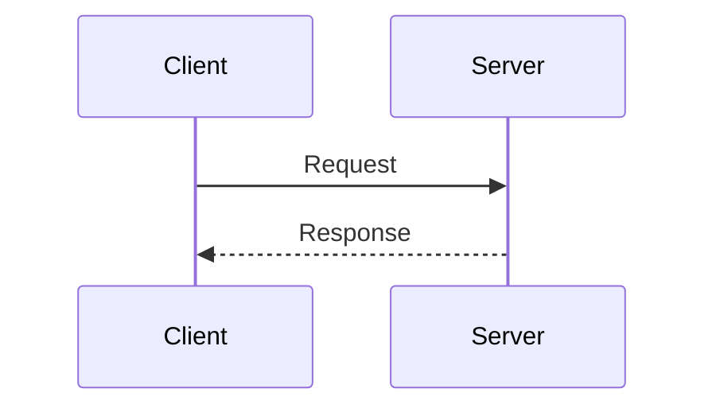
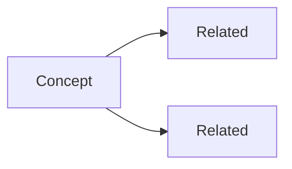

# visualize

把复杂输入重组为对其信息形态最可读的呈现格式。

## 输出结构

按序输出，每节保持紧凑，不写前言：

1. **Analogy** — 一句日常类比
2. **Visual** — 按下方选型出图
3. **Key points** — 3–5 条要点（图已自明时可省）
4. **Gotcha** — 一个常见误解或非显然细节

## 格式选型

按信息形态选择：

- **层级 / 包含关系**（嵌套结构、"由…组成"、目录树）→ ASCII 树
- **过程 / 流程**（步骤、分支决策、"然后"）→ Mermaid flowchart
- **时序 / 交互**（参与者、请求响应、时间线）→ Mermaid sequenceDiagram
- **对比 / 选项**（利弊、特性差异、"vs"）→ 结构化列表（禁用表格）
- **概念网络**（关系、依赖、"关联到"）→ Mermaid graph
- **大型混合系统**（多面向主题、架构总览）→ 分节 + 混合格式

拿不准时选更简单的：层级浅用 ASCII 树不用 Mermaid；关系少用列表不用
graph。复杂问题用问题树拆解，规划阶段用 MECE 树保证不重不漏。

## 格式参考

**ASCII 树** — 层级：

```
Root
├── Child A
│   ├── Grandchild 1
│   └── Grandchild 2
└── Child B
```

**Mermaid flowchart** — 含决策的流程：



**Mermaid sequenceDiagram** — 参与者交互：



**结构化列表** — 对比选项：

```markdown
- **Option A**
  - 优势：…
  - 代价：…
- **Option B**
  - 优势：…
  - 代价：…
```

**Mermaid graph** — 概念网络：


